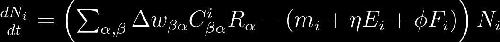

# Microbial Cross-feeding Community Simulator

[](https://github.com/Jakab-Mate/MiCroSim.jl/actions/workflows/CI.yml?query=branch%3Amain)

## A general-purpose microbial consumer-resource model that outputs simulated data in the SummarizedExperiment (SE) format.

This project offers a quick and easy method for simulating microbial community dynamics based solely on their metabolic interactions. The model represents distinct microbial species as matrices that describe their net conversion rates in the form *A -> nB*, where *A* is the metabolite consumed, *B* is the metabolite excreted into a shared environment, and *n* is a stoichiometric constant. Additionally, the species housing the above net conversion (or reaction), will have generated some value (energy) during the process, which contributes to its own growth. Once excreted, metabolite *B* may be utilized by a different species, enabling cross-feeding (syntrophy) between the populations present in the community. The model incorporates a feeding term that describes the type and amount of resources that flow into the system per unit time. All observed growth in the community can be derived from this inflow of resources: some species will be able to directly consume the resources flowing into the habitat (as a renewable or depletable resource), while the preferred resources for other species will be the byproducts of the reaction(s) performed by different species.

### Applicability

* **Simulate the growth of an initially populated microbial community and find the equilibrium abundances**

* **Simulate the succession of an initially empty microbial habitat where colonizers appear one by one**

* **Simulate the resilience of a microbial community against invaders appearing one by one**

### Installation
To install MiCroSim.jl directly from the github repository, use:

```julia
using Pkg
Pkg.add(url="https://github.com/Jakab-Mate/MiCroSim.jl.git")
```

### Workflow
The functions in this package rely on each other's outputs, so generally you will want to use them in the following order:
1. **create_metabolism(...)**<span style="display:inline-block; width: 56px;"></span>Generates the set of possible reactions (net conversions)

2. **create_species_pool(...)**<span style="display:inline-block; width: 48px;"></span>Generates the pool of possible species by sampling from the possible reactions

3. **sample_pool(...)**<span style="display:inline-block; width: 100px;"></span>Chooses the species that will appear in the simulation by sampling from the species pool

4. **generic_run(...)**<span style="display:inline-block; width: 107px;"></span>Takes the sampled species and simulates their dynamics based on a set of ODEs

Detailed instructions for using each function can be found in their dedicated sections.

### `create_metabolism()`

This function generates the set of all possible reactions, or in other words a universal metabolism. Each reaction is characterized by 4 attributes:
the metabolite that is being consumed, the metabolite that is being produced, the stoichiometric constant (unit resource produced per unit resource consumed), and the energy that the species gains per unit resource consumed. 

`create_metabolism()` outputs two matrices that hold the stoichiometric constants and the energy gains respectively. Each of these matrices is of size *RxR*, where *R* is the number of different resources, and each entry inside them corresponds to a specific reaction, where the column index indicates the resource being consumed, and the row index indicates the resource being produced. Importantly, the positions of zeros in these two matrices must align, and those reactions will not be possible.

To ensure energy conservation, we use the following equation to calculate the energy yields for each reaction:


where *w_a* and *w_b* denote the energy content of the resources and *D_ba* is the stoichiometric constant.

To simulate a gut-microbiome scenario, where most reactions are catabolic, `create_metabolism()` operates under the following assumptions:
* Resources can be grouped into different levels of decomposition, based on their energy content
* Reactions will always yield some energy, meaning that the resource produced will always be of a lower level (more decomposed) than the resource consumed

**Mandatory parameters**

This function has no mandatory parameters.

**Optional parameters**
* ***n_resources:*** The number of different resources in the network, which determines the size of the output matrices. *Default value is 10*
* ***n_levels:*** The number of levels of decomposition. Must be smaller or equal to *n_resources*, because each level will have at least one resource belonging to it. The lowest and the highest levels can only have one resource, and thus, the remaining resources will be of intermediate levels. *Default value is 5*
* ***energy_yields:*** Either "Uniform_1" or "Random". Denotes the energy difference between levels of decomposition, which can either be uniformly 1, or a random number whose expected value is 1. *Default is "Uniform_1"*
* ***rng:*** See section Reproducibility

### `create_species_pool()`

This function generates a pool of species, a subset of which will be used for simulations later. The species pool consists of different families, whose members are functionally similar to each other. Family members will always possess the same set of reactions, with varied reaction rates. Each family has a "prior" or holotype, whose reaction rates are vectorized and used as the density parameter of a Dirichlet distribution. The reaction rates of family members are then sampled from this Dirichlet distribution. Families can either be specialist or generalist. Specialist families will have 2-3 reactions, while generalists will have 4-5. 

Returning to our gut-microbiome scenario, we have introduced host regulation, the extent of which we assume to be identical in the members of the same family. We make the assumption that when the population of a microbial species reaches a certain size, the host will recognize this species as a potential threat, and start regulating its growth. Regulation is imposed according to the following equation:


where *G_i* is the growth rate of species *i* without host regulation, *a* controls the strength/speed of host regulation, *k* controls the critical population size and *N_i* is the population size of species *i*.

**Mandatory parameters**
* ***D:*** Matrix that denotes the possible reactions to sample from. The stoichiometric matrix and the energy_yield matrix are equally suitable for this role. Any non-zero position in the matrix will be deemed possible.

**Optional parameters**
* ***n_families:*** The number of families (functional groups) to create. *Default is 5*
* ***family_size:*** The number of members inside a family. To exclude families from your simulations, set this parameter to 1, which will result in a number of functionally independent species equal to *n_families*. *Default is 100*
* ***dirichlet_hyper:*** The higher the value of this parameter, the more similar species will be inside the same family. *Default is 100*
* ***maintenance:*** The average cost of maintenance throughout the community. *Default is 0.1* 
* ***between_family_var:*** The variance of maintenance between families. *Default is 0.1*
* ***inside_family_var:*** The variance of maintenance between members of the same family. *Default is 0.05* 
* ***specialist:*** Integer value that will be interpreted relative to *generalist*. *Default is 1*
* ***generalist:*** Integer value. The expected ratio of generalist and specialist families in the species pool will be equal to the ratio of these parameters. *Default is 1*
* ***a_dist:*** Parameter of type *Distributions.Sampleable*, which controls the speed of host regulation. *Default is Uniform(0.5, 1.5)*
* ***k_dist:*** Parameter of type *Distributions.Sampleable*, which controls the population size where the host starts regulating growth. *Default is Uniform(99.999, 100.001)*
* ***h:*** Parameter that controls the allocation of reaction rates. Before applying the effect of *h*, reaction rates in a single species will always sum to 1. These values are then divided by the sum of the reaction rates raised to the power of *h*. Values between 0-1 can be expected to favor specialists, while values above 1 can be expected to favor generalists.
* ***rng:*** See section Reproducibility

**Output**

Output is a single object of type ***PoolStruct***. To access this type, use `MiCroSim.PoolStruct()`. This structure will have the following fields:
* ***pool:*** An array of size *n_resources x n_resources x (n_families x family_size)* which contains the matrices of all species inside the species pool

The rest of the fields are all attribute vectors of size *(n_families x family_size)*

* ***family_ids:*** Denotes the family of each species.
* ***m:*** Denotes the maintenance values of each species.
* ***n_reactions:*** Denotes the number of reactions that each species houses
* ***n_splits:*** Denotes cumulative complexity of each species' reaction repertoire
* ***a:*** Denotes host regulation speed for each species
* ***k:*** Denotes critical population size for each species

### `sample_pool()`

This function randomly chooses some species matrices from a pool and takes the corresponding subset of the attribute vectors in the *PoolStruct*. It also assigns initial abundances (values between 0 and 1) for the species in the sample and all of the different resources.

**Mandatory parameters**
* ***p:*** A *PoolStruct*
* ***n_species:*** Number of species initially present in the community
* ***n_invaders:*** Number of species that will appear successively in the community

**Optional parameters**
* ***rng:*** See section Reproducibility

**Output**
Output is a single object of type ***SampleStruct***. To access this type, use `MiCroSim.SampleStruct()`. This structure will have the following fields:
* ***n_species:*** Feed forward parameter value
* ***n_invaders:*** Feed forward parameter value
* ***C:*** Sample of species matrices 
* ***family_ids:*** Corresponding family ID-s
* ***m:*** Corresponding maintenance costs
* ***n_reactions:*** Corresponding number of reactions
* ***n_splits:*** Corresponding complexity metric
* ***a:*** Corresponding host regulation speed
* ***k:*** Corresponding critical population size
* ***species_abundance:*** Initial abundances for each of the sampled species
* ***resource_abundance:*** Initial abundances for each resource

### `generic_run()`

This function takes a sample and solves a set of Ordinary Differential Equations (ODEs) to simulate the community dynamics. Along with the sample there are several tradeoff-s and other parameters controlling the simulation, whose values can be set here. In order to better understand what these parameters do, let's look at the ODEs:

Species dynamics is given by:



<a id="species"></a>
where *delta_w* is the energy yield matrix *C* are the species matrices, *R* are the resource abundances, *m* are the default maintenance values, *E* are the complexity metrics, *eta* describes how the complexity metrics contribute to maintenance costs, *F* are the number of reactions, *phi* describes how the number of reactions contribute to maintenance costs and *N* are the species abundances.

Resource dynamics is as follows:


<a id="resource"></a>
where $K$ are the inflow rates, *tau* are the dilution rates, *D* is the stoichiometric matrix and the rest of the parameters are the same as above. The first term describes the inflow and depletion of resources from and into an outer environment, the second (negative) term describes consumption and the last (positive) term describes production.

**Mandatory parameters**
* ***sample:*** A *SampleStruct*

**Recommended but optional parameters**
* ***path:*** Specifies the output folder for the results of the simulation. *Default is `homedir()`*
* ***t_span:*** Tuple(Int64, Int64) that specifies the starting and ending time points for the simulation. *Default is (0, 1000)*
* ***D:*** Stoichiometric matrix. *Defaults to a random matrix generated by `create_metabolism()`*
* ***W_ba:*** Energy yield matrix. *Defaults to a random matrix generated by `create_metabolism()`*

If either one of *D* or *W_ba* is missing, a warning is raised and both matrices will be given by `create_metabolism()` to ensure compatibility

**Optional parameters**
* ***t_inv:*** Specifies the time between the appearance of two consecutive invading species. *Default is 25.0*
* ***t_inv_0:*** Specifies the time of the first invasion *Default is 100.0*
* ***cutoff:*** Specifies the abundance threshold below which a species can be considered extinct. *Default is 0.0001*
* ***phi:*** See *phi* in [species dynamics](#species). *Default is 0.1*
* ***eta:*** See *eta* in [species dynamics](#species). *Default is 0.1*
* ***tau:*** See *tau* in [resource dynamics](#resource). *Defaults to a vector of length n_resources, where the value corresponding to the first (highest energy) resource is 100.0 and the rest are 0.0*
* ***alpha:*** See *K* in [resource dynamics](#resource). *Defaults to a vector of length n_resources, where all elements are 1.0*
* ***plot:*** Boolean parameter that controls whether to plot the results. *Defaults to True*
* ***host_regulation:*** Boolean parameter that controls whether host regulation is turned on. *Defaults to True*

**Output**
Returns time series data in a SummarizedExperiment (SE) data container, which can be used for a variety of analyses. For details, see [MicrobiomeAnalysis.jl](https://github.com/JuliaTurkuDataScience/MicrobiomeAnalysis.jl)

### Reproducibility

The functions in this package (apart from `generic_run()`) are stochastic, and therefore can lead to different results at different times. To ensure reproducibility, the stochastic functions all have an "rng" parameter, where a random number generator can be plugged in.

Example:
```julia
using Random
my_rng = MersenneTwister(1234)
D, W_ba = create_metabolism(rng=my_rng)
```

### Design your own metabolism

The best way to contribute to this project is by curating universal metabolisms in the form of stoichiometric and energy yield matrices. Admittedly, the reaction systems that may arise from `create_metabolism()` are limited, but more complex metabolic networks can also be implemented, for example modeling synthetic processes by setting energy yields negative (that is, a species invests into producing a metabolite). Furthermore, pathway databases such as KEGG coupled with microbial whole genome data open the possibility for deriving net conversions from real-world experiments.

### Acknowledgements
This project has benefited from contributions and insights of the following individuals and groups:

* **István Scheuring** and **Gergely Boza** from the Centre for Ecological Research, Budapest, provided essential theoretical guidance for the model's development.

* **Giulio Benedetti** and the [**TurkuDataScience**](https://datascience.utu.fi/) team form the University of Turku, Turku, were instrumental in setting up and optimizing the Julia package.

* The model was inspired by the work of [Goldford et al. (2018)](10.1126/science.aat1168).

### Funding

**This project received funding from the European Union’s Horizon 2020 research and innovation programme (under grant agreement 952914; FindingPheno).**

### Contact me

For inquiries and bug reports, contact Jakab Máté: mate.jakab@ecolres.hu


