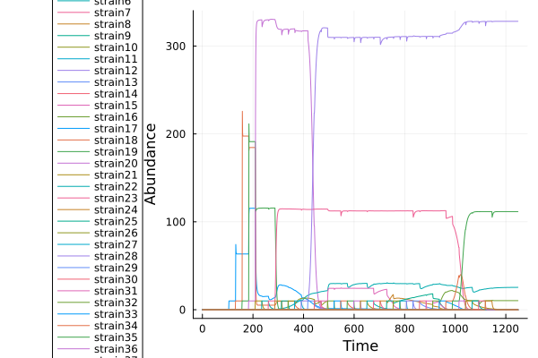
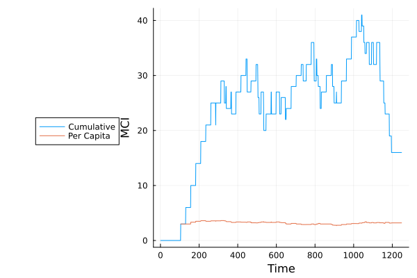

## Introducing colonizers into an initially empty habitat

```julia
using MiCroSim

n_resources = 15
# let's supply multiple resources extrenally this time
supplied_resources = 3

# create vector of resource availabilities
alpha = vcat(fill(100.0, supplied_resources), fill(0.0, n_resources - supplied_resources))

D, W_ba = create_metabolism(n_resources=n_resources)
pool = create_species_pool(D)

# start from an empty community, and add 50 species one by one
sample = sample_pool(pool, 0,  40)

# simulate dynamics using the given resource availability
out = generic_run(sample, D=D, W_ba=W_ba, alpha=alpha, host_regulation=false, t_span=(0, 1200))

#figures will now appear in homedir, since we didn't specify a path
```

The resulting species dynamics is illustrated below:



Above the changes in abundance, we also track some valueable information about the species present in the network such as number of reactions or complexity of reaction repertoires. This is enabled by the rowdata fields of the SummarizedExperiment output object, which is used to automatically create plots.

For example, the figure below shows the Metabolic Capacity Index representative of the community as the colonization progresses. This is calculated from the number of reactions that each species houses. These measures could be useful for relating the simulation results to real world experiments such as that of [Marcos et al. (2023)](https://www.researchsquare.com/article/rs-2885808/v1).

