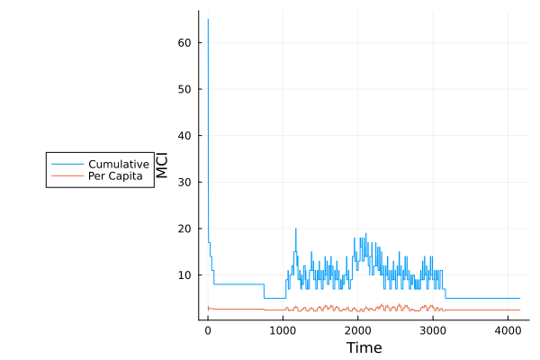

### Check the robustness of an equilibrium state community against invaders

```julia
using MiCroSim

n_resources = 16
supplied_resources = 2
alpha = vcat(fill(100.0, supplied_resources), fill(0.0, n_resources - supplied_resources))

# Create a metabolism with 8 levels of decomposition
n_levels = 8 
D, W_ba = create_metabolism(n_resources=n_resources, n_levels=n_levels)

pool = create_species_pool(D, n_families=10, family_size=20)

# Start from a populated community, and add 80 invading species
sample = sample_pool(pool, 20,  80)

# Simulate dynamics of initial community until t=1000 and then start adding invaders 
out = generic_run(sample, D=D, W_ba=W_ba, alpha=alpha, t_inv=25.0, t_inv_0=1000.0, t_span=(0, 4000), host_regulation=false)
```

The fruitless efforts of invading species are best illustrated on the MCI plot. When invasion events stop, the community returns to the initial equilibrium state.



