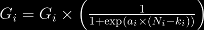
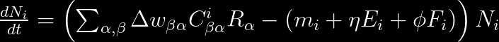
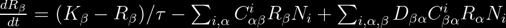

# Microbial Cross-feeding Community Simulator

[](https://github.com/Jakab-Mate/MiCroSim.jl/actions/workflows/CI.yml?query=branch%3Amain)

## A general-purpose microbial consumer-resource model that outputs simulated data in the SummarizedExperiment (SE) format.

This project offers a quick and easy method for simulating microbial community dynamics based solely on their metabolic interactions. The model represents distinct microbial species as matrices that describe their net conversion rates in the form *A -> nB*, where *A* is the metabolite consumed, *B* is the metabolite excreted into a shared environment, and *n* is a stoichiometric constant. Additionally, the species housing the above net conversion (or reaction), will have generated some value (energy) during the process, which contributes to its own growth. Once excreted, metabolite *B* may be utilized by a different species, enabling cross-feeding (syntrophy) between the populations present in the community. The model incorporates a feeding term that describes the type and amount of resources that flow into the system per unit time. All observed growth in the community can be derived from this inflow of resources: some species will be able to directly consume the resources flowing into the habitat (as a renewable or depletable resource), while the preferred resources for other species will be the byproducts of the reaction(s) performed by different species.

## Applicability

* **Simulate the growth of an initially populated microbial community and find the equilibrium abundances**

* **Simulate the succession of an initially empty microbial habitat where colonizers appear one by one**

* **Simulate the resilience of a microbial community against invaders appearing one by one**

## Installation
To install MiCroSim.jl directly from the github repository, use:

```julia
using Pkg
Pkg.add(url="https://github.com/Jakab-Mate/MiCroSim.jl.git")
```

## Workflow
The functions in this package rely on each other's outputs, so generally you will want to use them in the following order:
1. **create_metabolism(...)**
    Generates the set of possible reactions (net conversions), or in other words a universal metabolism. Each reaction is characterized by 4 attributes: the metabolite that is being consumed, the metabolite that is being produced, the stoichiometric constant (unit resource produced per unit resource consumed), and the energy that the species gains per unit resource consumed. 

    `create_metabolism()` outputs two matrices that hold the stoichiometric constants and the energy gains respectively. Each of these matrices is of size *RxR*, where *R* is the number of different resources, and each entry inside them corresponds to a specific reaction, where the column index indicates the resource being consumed, and the row index indicates the resource being produced. Importantly, the positions of zeros in these two matrices must align, and those reactions will not be possible.

    To simulate a gut-microbiome scenario, where most reactions are catabolic, `create_metabolism()` operates under the following assumptions:
    * Resources can be grouped into different levels of decomposition, based on their energy content
    * Reactions will always yield some energy, meaning that the resource produced will always be of a lower level (more decomposed) than the resource consumed

2. **create\_species\_pool(...)**
    Generates the pool of possible species by sampling from the possible reactions, a subset of which will be used for simulations later. The species pool consists of different families, whose members are functionally similar to each other. Family members will always possess the same set of reactions, with varied reaction rates. Each family has a "prior" or holotype, whose reaction rates are vectorized and used as the density parameter of a Dirichlet distribution. The reaction rates of family members are then sampled from this Dirichlet distribution. Families can either be specialist or generalist. Specialist families will have 2-3 reactions, while generalists will have 4-5. 

    Returning to our gut-microbiome scenario, we have introduced host regulation, the extent of which we assume to be identical in the members of the same family. We make the assumption that when the population of a microbial species reaches a certain size, the host will recognize this species as a potential threat, and start regulating its growth. Regulation is imposed according to the following equation:

    

    where *G_i* is the growth rate of species *i* without host regulation, *a* controls the strength/speed of host regulation, *k* controls the critical population size and *N_i* is the population size of species *i*.

3. **sample_pool(...)**
    Chooses some species matrices from a pool and takes the corresponding subset of the attribute vectors. It also assigns initial abundances (values between 0 and 1) for the species in the sample and all of the different resources.

4. **generic_run(...)**
    Takes a sample and solves a set of Ordinary Differential Equations (ODEs) to simulate the community dynamics. Along with the sample there are several tradeoff-s and other parameters controlling the simulation, whose values can be set here. In order to better understand what these parameters do, let's look at the ODEs:

    Species dynamics is given by:

    

    <span id="species"></span>
    where *delta_w* is the energy yield matrix *C* are the species matrices, *R* are the resource abundances, *m* are the default maintenance values, *E* are the complexity metrics, *eta* describes how the complexity metrics contribute to maintenance costs, *F* are the number of reactions, *phi* describes how the number of reactions contribute to maintenance costs and *N* are the species abundances.

    Resource dynamics is as follows:

    

    <span id="resource"></span>
    where $K$ are the inflow rates, *tau* are the dilution rates, *D* is the stoichiometric matrix and the rest of the parameters are the same as above. The first term describes the inflow and depletion of resources from and into an outer environment, the second (negative) term describes consumption and the last (positive) term describes production.

    **spatial_run(...)** is an alternative to `generic_run`, and is applicable in cases where the modeled habitat can be partitioned into local communities along some linear axis, such as the gut. The local communities interact with each other through abduction (unidirectional flow) and diffusion (bidirectional flow). These processes may affect species and resources at different rates, which the user can specify. The outer environment is assumed to be directly connected only to the first local community (as is the case in the gut), and thus, invaders and resource input will first appear here, but may spread to the subsequent local communities due to the aforementioned two processes.

**Detailed instructions for using each function can be found in the Manual and Tutorial sections**

## Design your own metabolism

The best way to contribute to this project is by curating universal metabolisms in the form of stoichiometric and energy yield matrices. Admittedly, the reaction systems that may arise from `create_metabolism()` are limited, but more complex metabolic networks can also be implemented, for example modeling synthetic processes by setting energy yields negative (that is, a species invests into producing a metabolite). Furthermore, pathway databases such as KEGG coupled with microbial whole genome data open the possibility for deriving net conversions from real-world experiments.

## Acknowledgements
This project has benefited from contributions and insights of the following individuals and groups:

* **István Scheuring** and **Gergely Boza** from the Centre for Ecological Research, Budapest, provided essential theoretical guidance for the model's development.

* **Leo Lahti**, **Giulio Benedetti**, **Moein Khalighi** and the rest of the [**TurkuDataScience**](https://datascience.utu.fi/) team form the University of Turku, Turku, were instrumental in setting up and optimizing the Julia package. Perhaps more importantly, I would like to thank them for their hospitality throughout my secondment in Turku.

* The model was inspired by the work of [Goldford et al. (2018)](https://doi.org/10.1126/science.aat1168).

## Funding

**This project received funding from the European Union’s Horizon 2020 research and innovation programme (under grant agreement 952914; FindingPheno).**

## Contact me

For inquiries and bug reports, contact Jakab Máté: mate.jakab@ecolres.hu


